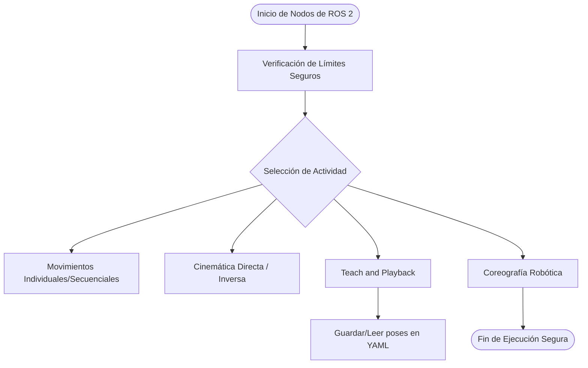

# Laboratorio No. 05: Cinemática - Robot Phantom X Pincher X100

# Integrantes

- [José Luis Pulido Fonseca](https://github.com/jpulidof)
- [Jairo David Díaz Luna](https://github.com/Axum-User)

# Informe

## Índice

1. [Descripción General y Entorno](#descripción-general-y-entorno)
2. [Diagrama de Flujo y Plano de Planta](#diagrama-de-flujo-y-plano-de-planta)
3. [Actividad 1: Preparación del robot](#actividad-1-preparación-del-robot)
4. [Actividad 2: Identificación de motores y articulaciones](#actividad-2-identificación-de-motores-y-articulaciones)
5. [Actividad 3: Medición del robot](#actividad-3-medición-del-robot)
6. [Actividad 4: Movimiento individual de articulaciones](#actividad-4-movimiento-individual-de-articulaciones)
7. [Actividad 5: Calibración de cero y error articular](#actividad-5-calibración-de-cero-y-error-articular)
8. [Actividad 6: Determinación de límites seguros](#actividad-6-determinación-de-límites-seguros)
9. [Actividad 7: Movimiento simultáneo](#actividad-7-movimiento-simultáneo)
10. [Actividad 8: Movimiento secuencial](#actividad-8-movimiento-secuencial)
11. [Actividad 9: Interpolación de trayectorias](#actividad-9-interpolación-de-trayectorias)
12. [Actividad 10: Trayectoria sinusoidal de una articulación](#actividad-10-trayectoria-sinusoidal-de-una-articulación)
13. [Actividad 11: Cinemática directa](#actividad-11-cinemática-directa)
14. [Actividad 12: Cinemática inversa](#actividad-12-cinemática-inversa)
15. [Actividad 13: Enseñanza y repetición de poses](#actividad-13-enseñanza-y-repetición-de-poses)
16. [Actividad 14: Trazado de una figura](#actividad-14-trazado-de-una-figura)
17. [Actividad 15: Reto final - Coreografía robótica](#actividad-15-reto-final---coreografía-robótica)
18. [Código Fuente](#código-fuente)
19. [Evidencias de Video](#evidencias-de-video)
20. [Conclusiones Individuales](#conclusiones-individuales)

---

## Descripción General y Entorno

(Redactar aquí la descripción de la solución planteada para el laboratorio. Indicar que se usa ROS 2 Jazzy, RViz y Python 3 para controlar las 5 articulaciones del Phantom X Pincher X100 y resolver su cinemática).

---

## Diagrama de Flujo y Plano de Planta

### Diagrama de Flujo de las Acciones del Robot


### Plano de Planta

(Insertar aquí la imagen o diagrama de planta con la distribución espacial del robot, el papel para dibujar y las distancias en el entorno físico).

---

## Actividad 1: Preparación del robot

Se ubicó el robot en una posición segura, se verificó la conexión de los servomotores y se comprobó que el modelo en RViz correspondiera sincronizadamente con la postura física del manipulador tras la energización.

---

## Actividad 2: Identificación de motores y articulaciones

| Articulación | ID Dynamixel | Referencia | Sentido positivo | Función |
| --- | --- | --- | --- | --- |
| **Base** |001|AX-12A|Antihorario|Permitir la rotación del eje Z|
| **Hombro** |002|AX-12A| Antihorario |Permitir la rotación del eje Y|
| **Codo** | 003 |AX-12A| Antihorario |Permitir la rotación del eje Y|
| **Muñeca** | 004 |AX-12A| Antihorario |Permitir la rotación del eje Y|
| **Pinza** | 005 |AX-12A| Antihorario |Transformar la rotación en translación, para que por medio de fricción, se puedan sostener objetos en el eje Z|

---

## Actividad 3: Medición del robot

* **Altura de la base:** (Valor medido)
* **Distancia entre ejes consecutivos:** (Valores)
* **Longitud de cada eslabón:** (Valores)
* **Distancia última articulación al TCP:** (Valor)
* **Dimensiones de la pinza:** (Valores)

**(Insertar aquí el diagrama geométrico con las dimensiones, ejes de movimiento y sistemas coordenados).**

---

## Actividad 4: Movimiento individual de articulaciones

(Describir el desarrollo de la prueba donde se enviaron tres posiciones angulares diferentes a cada articulación por separado, regresando siempre a la posición de referencia).

---

## Actividad 5: Calibración de cero y error articular

Para las cinco posiciones de prueba por articulación, se calculó el $e = q_{deseado} - q_{medido}$.

* **Error máximo observado:** (Valor)
* **Error promedio:** (Valor)
* **Desplazamiento de cero:** (Valor)
* **Corrección implementada:** (Descripción de cómo se corrigió en el código).

**(Insertar aquí las gráficas de posición deseada vs. posición medida para cada articulación).**

---

## Actividad 6: Determinación de límites seguros

| Articulación | Límite inferior | Límite superior | Margen de seguridad |
| --- | --- | --- | --- |
| **Base** | -150 | 150 | 300 |
| **Hombro** | -20 | 10 | 30 |
| **Codo** | -95 | 95 | 190 |
| **Muñeca** | -95 | 95 | 190 |
| **Pinza** | -85 | 55 | 140 |

*Nota: Se implementó un bloqueo por software en Python para impedir el envío de comandos fuera de estos rangos.*

---

## Actividad 7: Movimiento simultáneo

Se ejecutaron las siguientes configuraciones de prueba (Base, Hombro, Codo, Muñeca, Pinza):

1. `[0, 0, 0, 0, 0]`
2. `[25, 25, 20, -20, 0]`
3. `[-35, 35, 30, 30, 0]`
4. `[85, -20, 55, 25, 0]`
5. `[80, 35, 55, -45, 0]`

*(Justificar aquí si alguna posición debió ser ajustada por motivos de seguridad o prevención de autocolisión).*

---

## Actividad 8: Movimiento secuencial

(Comparar aquí el desempeño entre el movimiento simultáneo de la Actividad 7 y la ejecución estrictamente secuencial: 1. Base -> 2. Hombro -> 3. Codo -> 4. Muñeca -> 5. Pinza, evaluando tiempo de ejecución, trayectoria del TCP y suavidad).

---

## Actividad 9: Interpolación de trayectorias

Se programaron dos métodos de interpolación para movimientos de gran amplitud:

1. **Interpolación Lineal.**
2. **Interpolación (Cúbica / Quíntica).**

**(Insertar aquí las gráficas de posición angular vs. tiempo para ambos perfiles y presentar la comparación de suavidad).**

---

## Actividad 10: Trayectoria sinusoidal de una articulación

Se evaluó la función $q(t) = q_0 + A \sin(2\pi ft)$ realizando 4 pruebas (variando dos amplitudes y dos frecuencias).

* **Error Máximo Registrado:** (Valor)
* **Error Cuadrático Medio (RMSE):** (Valor)

**(Insertar aquí las gráficas comparativas de posición deseada vs. posición medida).**

---

## Actividad 11: Cinemática directa

### Parámetros Denavit-Hartenberg (DH)

| $i$ | $\theta_i$ | $d_i$ | $a_i$ | $\alpha_i$ |
| --- | --- | --- | --- | --- |
| 1 | $q_1$ | 0 | 153 | 90 |
| 2 | $q_2$ | 0 | 106 | 0 |
| 3 | $q_3$ | 0 | 106 | 0 |
| 4 | $q_4$ | 0 | 96 | 0 |

*(Presentar las ecuaciones de las transformaciones homogéneas implementadas en Python para hallar `x, y, z, roll, pitch, yaw` y la comparación matemática contra las lecturas visuales de RViz para las 5 configuraciones de la Actividad 7).*

---

## Actividad 12: Cinemática inversa

Se implementó el algoritmo geométrico/algebraico que recibe una coordenada `(x, y, z)` y retorna una configuración articular.

* **Lógica implementada:** (Cálculo de soluciones posibles, identificación de codo arriba/abajo, descarte por límites, alerta de inalcanzabilidad).
* **Posiciones Cartesianas Evaluadas:** (Listar los 5 puntos cartesianos de prueba ejecutados y su resultado articular).

---

## Actividad 13: Enseñanza y repetición de poses

El modo Teach and Playback se desarrolló integrando un sistema de guardado mediante archivos YAML.

* **Proceso:** Lectura de $q_{actual}$, almacenamiento bajo una etiqueta en diccionario y exportación.
* **Prueba:** Se registraron y reprodujeron exitosamente $n \geq 8$ poses modificando paramétricamente el tiempo de transición entre ellas.

---

## Actividad 14: Trazado de una figura

* **Figura seleccionada:** (Triángulo / Cuadrado / Círculo / Iniciales).
* **Desarrollo:** (Explicar cómo se enviaron arreglos de puntos cartesianos `(x, y, z)` a la cinemática inversa manteniendo constante la altura `z` para presionar el marcador contra el papel).

**(Insertar aquí una imagen de la figura terminada o captura de RViz).**

---

## Actividad 15: Reto final - Coreografía robótica

* **Canción seleccionada:** (Chipi Chipi Chapa Chapa / Pedro, Pedro, Pedro).
* **Sincronización:** (Explicar cómo mapearon los instantes rítmicos de los $\geq 45$ segundos de música para coordinar los movimientos de Base, Hombro, Codo, Muñeca y Pinza sin violar los márgenes de seguridad y con ejecución automatizada de inicio a fin).

---

## Código Fuente

*(Incluir aquí los links directos a los scripts de Python dentro del repositorio).*

* [Enlace al Script Principal de Cinemática y Actividades](https://www.google.com/search?q=./src/)
* [Enlace al Script de la Coreografía](https://www.google.com/search?q=./src/)

---

## Evidencias de Video

1. **Video de Pruebas Técnicas (Actividades 1 a 14):** [Enlace a YouTube / Drive] (Debe contener movimiento individual, simultáneo, secuencial, teach & playback y trazado de figura, iniciando con la Intro LabSIR).
2. **Video de la Coreografía Robótica (Actividad 15):** [Enlace a YouTube / Drive] (Rutina ininterrumpida sincronizada con la música, iniciando con la Intro LabSIR).

---

## Conclusiones Individuales

### José Luis Pulido Fonseca

* (Conclusión 1)
* (Conclusión 2)

### Jairo David Díaz Luna

* (Conclusión 1)
* (Conclusión 2)

```

```